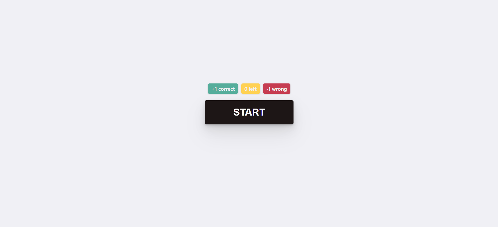
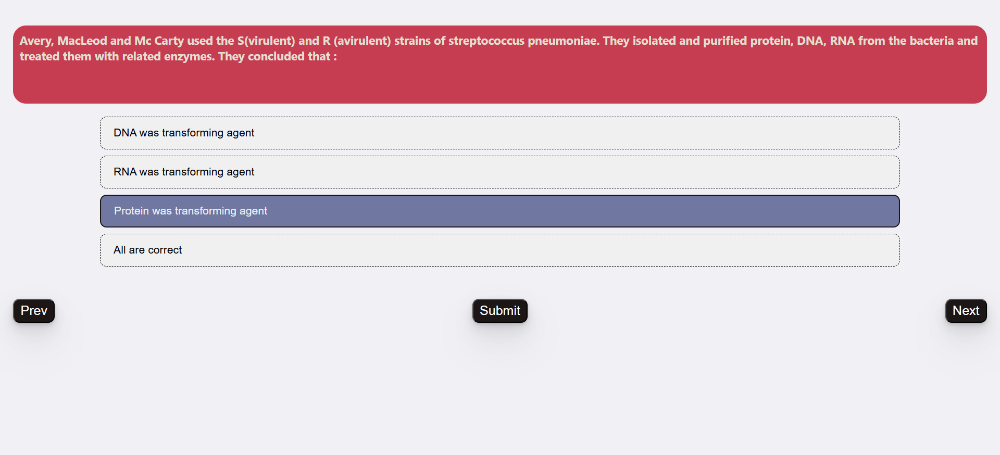
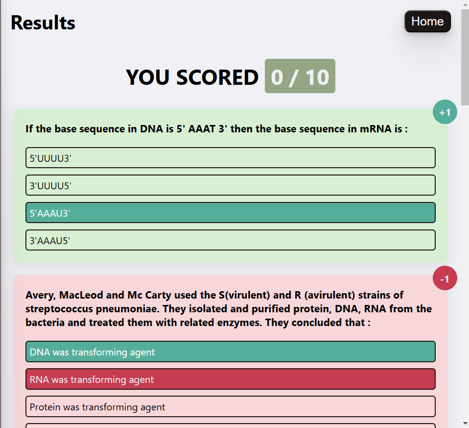

# Quiz Game - React Project

A fun and interactive quiz game built with React. The game awards +1 for correct answers, -1 for incorrect answers, and 0 for unanswered questions. The UI is visually appealing with beautiful colors, and the project includes a simple backend proxy server to handle API requests and avoid CORS issues.

## Table of Contents

- [Introduction](#introduction)
- [Features](#features)
- [ScreenShots](#screenshots)
- [Video]("video")

## Introduction

This project is a quiz game built using React. It fetches questions from an external API using a proxy backend server to avoid CORS issues. The game features a clean and modern UI with three main pages: Home, Quiz, and Results. Players earn points based on their answers and can view their final score on the Results page.

## Features

- **Interactive Quiz**: Answer questions and get instant feedback.
- **Scoring System**: +1 for correct answers, -1 for incorrect answers, and 0 for unanswered questions.
- **Beautiful UI**: Modern design with attractive colors and animations.
- **Backend Proxy**: A simple backend server to fetch questions and avoid CORS errors.
- **React Router DOM**: Navigation between Home, Quiz, and Results pages.

  ```

  ```
## Video Walkthrough

Watch the video walkthrough of the project here:  
[Interactive Quiz Application with Gamification - React Project Walkthrough](https://youtu.be/1iCkHJD_bBE)


## Screenshots

### Home Page



### Quiz Page



### Results Page



```

```
